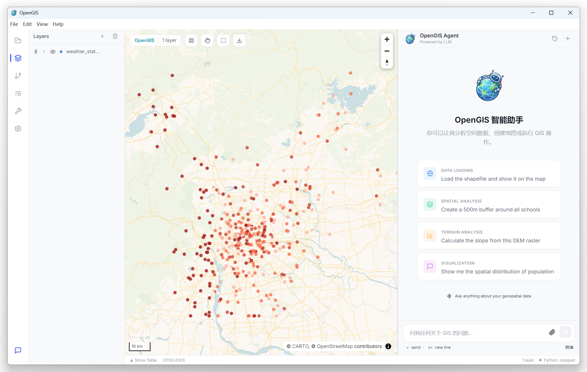
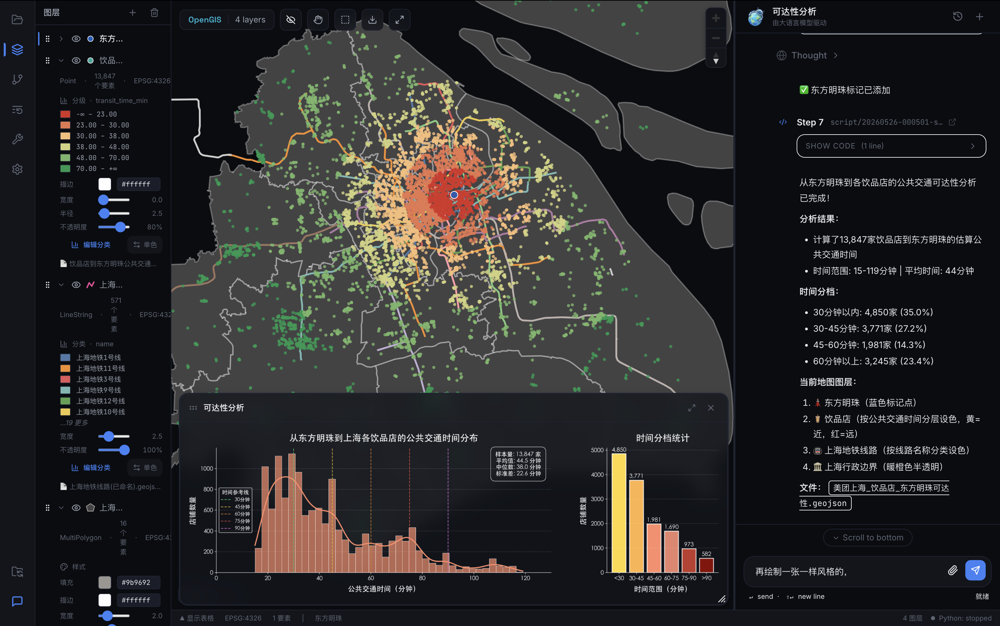
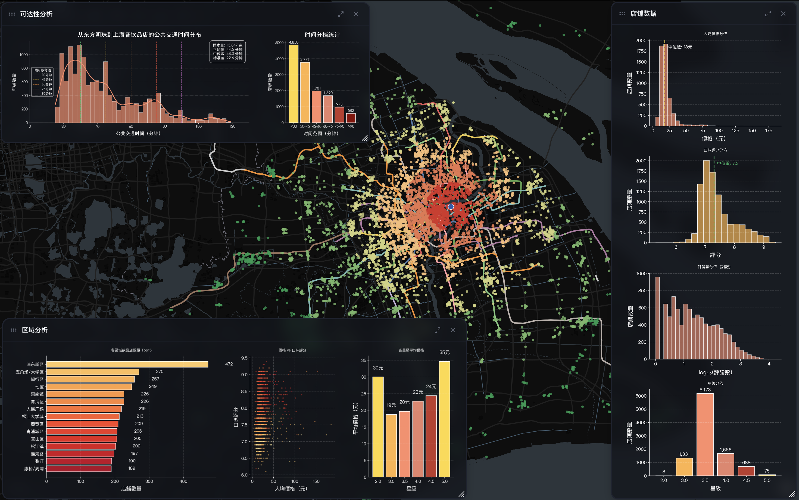
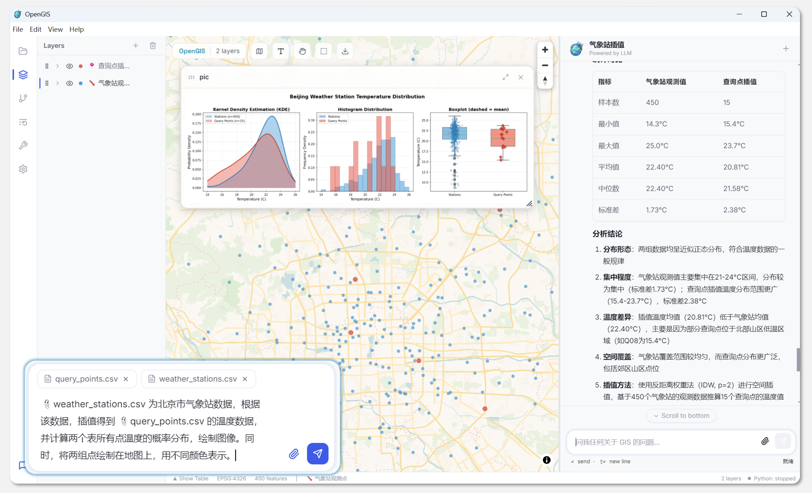
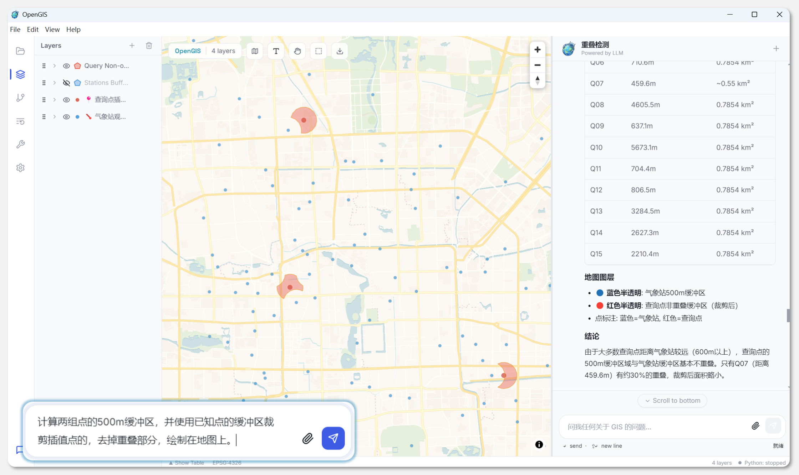
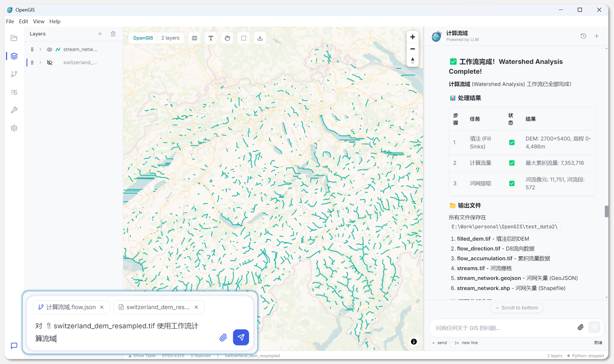

<p align="center">
  
</p>

<h1 align="center">OpenGIS</h1>

<p align="center">
  <strong>Agent 驱动的开源 GIS 桌面应用 — 用自然语言完成地理空间分析、制图、自动化与知识沉淀</strong>
</p>

<p align="center">
  <a href="#1-介绍">介绍</a> •
  <a href="#2-功能概览">功能概览</a> •
  <a href="#3-技术架构">技术架构</a> •
  <a href="#4-快速开始">快速开始</a> •
  <a href="#5-开发指南">开发指南</a> •
  <a href="#6-roadmap">Roadmap</a> •
  <a href="#7-许可">许可</a>
</p>

<p align="center">
  
  
  
  
  
  
</p>

---

<p align="center">
  <a href="https://www.youtube.com/watch?v=37wGkGV6h2U">
    
    <br>
    
  </a>
</p>

## 1. 介绍

OpenGIS 是一个基于 Agent 的开源 GIS 桌面应用。它不是一个简单的“地图 + 聊天框”，而是一个把 **GIS 数据管理、地图渲染、空间分析、制图导出、工作流、后台 Worker、可复用 Operation、记忆系统和工具治理** 放在同一个桌面环境里的实验性 GIS Agent 客户端。

项目仍在高速迭代中。当前目标不是替代 ArcGIS Pro / QGIS 的全部能力，而是探索一个更自然的 GIS 工作方式：用户用自然语言描述意图，Agent 在受控工具系统中读取数据、运行代码、调用地图能力、生成图表、沉淀脚本和 Operation，并把结果直接展示在地图、对话、看板或制图画布里。

<p align="center">
  
</p>
<p align="center"><sub>主界面：左侧资源 / 图层 / Workflow / Operation / Worker 等面板 · 中间 Map / Code / Layout Composer · 右侧 Agent Chat。</sub></p>

<br>
<p align="center">
  
</p>

<br>
<p align="center">
  
</p>

<br>
<p align="center">
  
</p>
<p align="center"><sub>Agent 可以读取数据、执行 Python、生成图表，并把图片 / 地图结果回显到对话和地图中。</sub></p>

<br>
<p align="center">
  
</p>
<p align="center"><sub>支持矢量、栅格、分类设色、分级设色、样式变量、图层排序、地图视角控制等 GIS 操作。</sub></p>

<br>
<p align="center">
  
</p>
<p align="center"><sub>Workflow 以 DAG 形式组织多步骤任务，节点间通过结构化输入 / 输出描述传递上下文。</sub></p>

## 2. 功能概览

### 2.1 Agent 能力

- **Function-call Agent Loop**：以结构化 tool call 为主，避免旧 CodeAct 时代从文本里猜代码块和工具调用。
- **代码执行**：保留受控 Python 执行工具，适合临时 GIS 分析、数据清洗、绘图和长尾算法验证。
- **工具治理**：所有工具经过统一 schema、权限、结果归一化、事件归档和前端展示。
- **计划 / 子 Agent / Workflow**：Plan、Subagent、Workflow 都归入同一套 session / run / MessagePart 协议。
- **记忆与知识沉淀**：结构化 MemoryStore、ContextProjector、KnowledgeExtractor、FailureMemory 共同管理上下文和经验。
- **Operation 复用**：一次复杂分析可以沉淀成可编辑、可验证、可运行、跨 workspace 共享的 Operation。
- **Worker 后台任务**：Agent 可以经用户批准创建 / 重启 / 暂停 / 删除常驻 Python Worker，用于动态数据接入和实时地图渲染。

### 2.2 GIS 与地图能力

- **矢量数据**：GeoJSON、CSV、Shapefile、KML、GeoPackage 等常见格式。
- **栅格数据**：GeoTIFF / TIFF 解析、前后端混合渲染、服务端瓦片、色带与透明度控制。
- **地图渲染**：MapLibre GL JS，支持点 / 线 / 面、分类设色、分级设色、大小变量、透明度变量、排序变量、标注、筛选、高亮。
- **动态地图**：Worker 通过 stdout JSON 协议持续推送 `rpc.ui.map.dynamic_layer_update`，前端即时更新动态图层。
- **三维视角**：地图 pitch / bearing 控制，支持进入 3D 视角和基础 extrusion 样式。
- **制图画布**：Layout Composer 支持地图框、比例尺、指北针、图例、画布比例、导出图片，并面向后续 ArcGIS / QGIS 风格扩展。
- **数据透视**：图层 / 文件可打开数据透视面板，表格、统计、字段分布和 Agent 分析结果分离展示。

### 2.3 自动化与扩展

- **Workflow**：面向多步骤分析的 DAG，节点可描述接收上游什么内容、输出什么内容。
- **Operation**：软件级原子操作，包含输入结构、输出结构、依赖、代码、说明和运行记录。
- **Worker**：常驻 Python 服务包，结构固定为 `main.py + config.json + manifest.json + src/`，适合实时数据、轮询 API、动态渲染。
- **Project Skills**：skills 是项目级能力 / 知识包，区别于 tool。Tool 是 Agent 可直接调用的函数；Skill 是用户接入的上下文、流程、约束或能力集合。
- **Run Archive**：每一轮 Agent 执行都归档为事件流、工具调用、MessagePart、artifact 和元数据。

## 3. 技术架构

### 3.1 总体进程模型

OpenGIS 是一个 **Electron 桌面壳 + React Renderer + Python Sidecar + Python 子进程 / Worker** 的混合架构：

```text
Electron Main
  ├─ 管理窗口、菜单、文件系统、设置、Python sidecar 生命周期
  │
  └─ Renderer (React + TypeScript)
       ├─ MapLibre 地图渲染
       ├─ Chat / MessagePart UI
       ├─ 图层、资源、Operation、Workflow、Worker、Layout Composer
       └─ JSON-RPC Dispatcher：处理 Python -> UI 的反向 RPC

Python Sidecar (FastAPI + uvicorn + LiteLLM)
  ├─ WebSocket JSON-RPC 服务
  ├─ Agent loop / session / memory / tool runtime
  ├─ GIS / OSM / datasource / raster / operation / workflow / worker 集成
  ├─ 每轮代码执行子进程
  └─ 常驻 Worker 进程
```

| 层 | 技术 | 主要职责 | 关键目录 |
|---|---|---|---|
| Electron Main | Electron 30 + Node | 窗口、菜单、IPC、Python sidecar 启停 | `electron/` |
| Renderer | React 18 + TypeScript + Zustand | UI、地图、图层状态、反向 RPC handler | `src/features/`、`src/services/`、`src/stores/` |
| Map Engine | MapLibre GL JS | WebGL 地图、source/layer 同步、导出 | `src/features/map/` |
| Python Sidecar | FastAPI + uvicorn + LiteLLM | JSON-RPC、Agent、Tool、Workflow、Worker | `python-backend/opengis_backend/` |
| Python Execution | subprocess runner | Agent 写的 Python 代码执行 | `agent/execution/` |
| Resident Worker | Python process | 后台动态数据、持续渲染、长期服务 | `worker/` |

### 3.2 通信模型：双向 JSON-RPC

Renderer 和 Python sidecar 之间通过一条 WebSocket 通道通信。协议是 JSON-RPC 2.0，同时支持两种方向：

```text
Renderer -> Python
  chat.user_message
  rpc.code.run_script
  rpc.runs.list / get
  rpc.agent.*
  rpc.worker.*

Python -> Renderer
  rpc.ui.map.add_layer_from_geojson
  rpc.ui.map.dynamic_layer_update
  rpc.ui.map.set_layer_style
  rpc.ui.ask.*
  chat / event notification
```

前端 `src/services/pythonClient.ts` 负责 WebSocket 连接、请求超时、通知分发和动态地图事件缓冲。入站 `rpc.ui.*` notification 进入 `src/services/rpc/handlers/`，最终写入 Zustand store 或直接调用 MapEngine。

关键原则：

- **地图状态在前端**：Python 不持有 MapLibre 句柄，所有图层事实以前端 store 为准。
- **重计算在 Python**：空间分析、栅格处理、模型推理、Operation、Worker 运行在 Python。
- **UI 操作走反向 RPC**：Python 工具通过 `rpc.ui.map.*` 指挥前端加载图层、更新样式、切换视角。
- **动态数据走通知流**：Worker stdout 输出一行 JSON，sidecar 解析后转发到前端 dynamic handler。

### 3.3 Agent 新架构

当前 Agent 已从旧 CodeAct 逐步升级为主流 function-call 架构，核心分层如下：

```text
AgentProfile
  -> SessionCoordinator
  -> ContextProjector / ProviderProjector
  -> LLM function-call streaming
  -> TurnRunner / LoopKernel
  -> ToolRuntime / PermissionRuntime
  -> EventLog / RunArchive / MessagePart
```

| 模块 | 职责 | 目录 |
|---|---|---|
| `agent/loop/` | AgentLoop、TurnRunner、LoopKernel、RuntimeControl、循环策略 | `python-backend/opengis_backend/agent/loop/` |
| `agent/execution/` | ToolRuntime、tool schema、参数校验、Python 执行、自动安装 | `agent/execution/` |
| `agent/context/` | ContextManager、ContextProjector、MemoryStore、压缩、失败记忆 | `agent/context/` |
| `agent/session/` | SessionCoordinator、queue、run session、inbox | `agent/session/` |
| `agent/governance/` | AgentProfile、PermissionRuntime、权限规则 | `agent/governance/` |
| `agent/telemetry/` | EventLog、MessagePart、RunArchive、script archive、artifact | `agent/telemetry/` |
| `agent/workflow/` | Workflow 模型、存储、输出传递、DAG 编排 | `agent/workflow/` |

#### 3.3.1 Function-call 优先

OpenGIS 现在以 function call 为 Agent 主路径。模型输出结构化 tool call，框架按 schema 执行工具并返回结构化结果。Python 代码执行仍是一个工具，但不再作为 loop 控制协议。

这样做解决旧 CodeAct 的几个问题：

- Agent 回复文本不会再被误当作 Python 代码执行。
- Tool 参数由 schema 约束，不靠自然语言解析。
- 前端可以统一展示 tool、code、artifact、operation、worker 和 error。
- 权限审批、工具裁剪、结果压缩、run 归档都有统一入口。

#### 3.3.2 MessagePart 展示协议

Agent 输出不再是一整段混合文本，而是事件化的 `MessagePart[]`：

| Part 类型 | 用途 |
|---|---|
| `text` | 普通 Agent 回复 |
| `tool` | 工具调用和结果 |
| `code` | 生成 / 执行 Python 代码 |
| `artifact` | 图片、报告、文件、图层等产物 |
| `operation` | Operation 运行块 |
| `progress` | 当前最底部的运行状态 |
| `plan` | Plan / Workflow 进度 |
| `error` | 错误和中断 |

前端 Chat 直接渲染 MessagePart。普通 tool call 默认折叠；Python 代码可折叠展示；执行输出默认压缩；图片和 Markdown 引用的本地资源通过安全路径转换渲染。

#### 3.3.3 Loop 收敛与异常保护

Agent loop 不靠硬编码某个任务“最多几步”，而是结合以下信号收敛：

- 模型自然停止且无 tool call。
- TurnObjective / DeviationGuard 检测目标偏离。
- Loop Anomaly Detector 检测重复工具、重复失败、无效重试。
- RuntimeControl 针对 worker / operation 等长任务做健康检查和收口。
- ToolRuntime 对错误结果做结构化反馈，鼓励修正原文件 / 原 operation，而不是绕开重写。

### 3.4 Tool、Skill、Operation 的边界

当前命名约定：

| 名称 | 定义 | 示例 | 生命周期 |
|---|---|---|---|
| **Tool** | Agent 可直接调用的函数能力，有 schema、权限、结果结构 | `read_file`、`edit_file`、`add_layer`、`start_worker` | 代码内置 |
| **Skill** | 用户 / 项目可接入的知识、流程、约束或能力包，可影响上下文与工具选择 | 外部 skill 包、项目级说明 | 项目 / 用户级 |
| **Operation** | 可复用的软件级原子操作，带输入输出 schema、依赖、主程序、说明和运行记录 | DBSCAN 聚类、核密度、格式转换 | 内置 + workspace |
| **Workflow** | DAG 多步骤任务编排，节点定义输入 / 输出描述 | 学术报告、流域分析 | `.flow.json` |
| **Worker** | 常驻 Python 服务，用于持续数据处理和动态渲染 | 航班追踪、动态点、实时轨迹 | workspace |

旧代码中曾经把工具也叫 skill。新架构中应当尽量避免混用：**工具叫 Tool，外部能力包叫 Skill，复用算法叫 Operation。**

### 3.5 Tool Runtime

所有工具集中在 `python-backend/opengis_backend/tools/`：

| 工具组 | 代表工具 | 说明 |
|---|---|---|
| 文件 | `read_file`、`write_file`、`edit_file`、`list_directory`、`glob`、`grep` | 支持模糊匹配、diff 输出、读前保护、文件建议 |
| Shell | `bash` | 带权限治理和风险提示的 shell 调用 |
| Web | `webfetch`、`websearch` | 抓取网页、实时搜索 |
| 地图 | `list_layers`、`add_layer`、`update_layer_style`、`set_categorized_style`、`set_graduated_style`、`set_layer_order` | 通过反向 RPC 操作前端地图 |
| 栅格 | `add_raster`、`get_raster_info`、`set_raster_style` | TIFF / GeoTIFF / 服务端瓦片 / 色带 |
| OSM | `osm_call` | Nominatim + Overpass 获取 OSM 数据 |
| DataSource | `datasource_call` | 内置数据源 |
| Workflow | `create_workflow`、`run_workflow` 等 | 创建、读取、保存、执行 Workflow |
| Operation | `list_operations`、`run_operation`、`edit_operation`、`validate_operation` | 运行和维护可复用操作 |
| Worker | `start_worker`、`start_dynamic_map_worker`、`restart_worker`、`wait_worker_update`、`pause_worker`、`delete_worker` | 常驻后台服务 |
| Report | `export_map_snapshot`、`write_report_section`、`export_report_pdf` | 报告与导出 |
| Subagent | `run_subagent` | 子 Agent 执行 |
| Debug | `debug_agent_context` | 上下文和工具暴露调试 |

ToolRuntime 负责：

- 将 Python 函数注册成 LLM 可见 JSON schema。
- 执行前做参数校验和权限决策。
- 执行后统一输出结构、截断大结果、生成 artifact pointer。
- 将 tool call / result 写入 RunArchive 和 MessagePart。
- 将前端 UI 需要的事件投影到统一流。

### 3.6 Memory 与 Context

新记忆系统不再以一整段 `memory.md` 注入为中心，而是分层组织：

```text
MemoryStore
  facts          # 稳定事实：项目、文件、图层、用户偏好
  recipes        # 可复用操作步骤和调试经验
  dataset_cards  # 数据集字段、范围、统计摘要、路径
  failure_memory # 重复错误、失败原因、修复建议

ContextProjector
  -> 根据当前用户意图检索相关 memory
  -> 组合 recent turns / working state / artifacts
  -> ProviderProjector 生成完整 provider request
```

关键点：

- **按任务检索**：不是把所有历史都塞进 system prompt，而是按当前 turn 选择相关事实。
- **完整 request 预算**：上下文裁剪不只看历史消息，也要看 system prompt、tools、memory、artifact、provider 格式后的完整请求。
- **失败记忆**：工具连续失败、包缺失、签名误用等会沉淀为 failure memory，用于下一轮避免重复踩坑。
- **知识提取**：run 结束后 KnowledgeExtractor 提取 facts、recipes、dataset cards。
- **用户指令**：全局偏好和项目级偏好分开管理。

### 3.7 RunArchive 与 Event-Sourced UI

每次 Agent run 都会写入 `.opengis/runs/<run_id>/`：

```text
meta.json
events.jsonl
message_parts.jsonl
tool_calls.jsonl
artifacts.jsonl
steps.jsonl
```

这套 event-sourced 结构让前端可以：

- 实时渲染 Chat。
- 恢复历史 run。
- 展示工具调用、代码、Operation、Worker、Artifact。
- 检测异常结束并补齐 running 状态。
- 将长输出落盘为 artifact pointer，避免 UI 和上下文被大 JSON 卡死。

### 3.8 Workflow 架构

Workflow 是 DAG 编排，不是简单 prompt 模板。每个 node 需要描述：

- 它接收上游什么内容。
- 它要执行什么任务。
- 它输出给下游什么内容。
- 失败时是否重试。

Workflow 文件通常存储为 `.flow.json`。内置 workflow 位于项目资源或 workspace 的 `.opengis/workflows/`，用户也可以让 Agent 创建和保存 workflow。

执行方式：

```text
Workflow document
  -> parse nodes / edges
  -> topological sort
  -> node session
  -> node output summary + artifact
  -> downstream context
  -> final report
```

前端 Workflow UI 和 Plan UI 共享 MessagePart 协议，但显示样式不同：Workflow 强调 DAG 进度，Plan 强调当前任务步骤。

### 3.9 Operation 架构

Operation 是比脚本更稳定的复用单元。它用于把一次复杂探索沉淀为以后可复用、可修改、可验证的原子能力。

一个 Operation 包含：

```text
operation/
  manifest.json      # 名称、描述、输入输出 schema、依赖、版本
  main.py            # 唯一入口
  README.md          # 使用说明
  examples/          # 示例参数
  runs/              # 运行记录
```

Operation 分两类：

- **内置 Operation**：随 OpenGIS 源码分发，所有 workspace 共享。
- **Workspace Operation**：用户项目中创建，可手动提升为内置。

Agent 可以：

- 查询 Operation。
- 按 schema 构造参数运行。
- 运行失败后读取 Operation 代码并修复。
- 将稳定脚本提升为 Operation。

前端 Operation 面板采用列表 + 详情结构，Chat 中也会以独立 Operation block 展示运行状态和结果。

### 3.10 Worker 架构

Worker 是常驻 Python 服务，适合以下场景：

- 持续轮询外部 API。
- 实时读取动态数据。
- 持续处理数据流。
- 将动态点、轨迹、状态推送到地图。

Worker 服务包结构：

```text
worker/<name>-<worker_id>/
  main.py              # 唯一入口
  opengis_worker.py    # OpenGIS 自动生成 helper，不应手改
  config.json          # worker_id、interval_seconds、layer ids、API 参数
  manifest.json        # 服务元数据、权限、动态层声明
  README.md
  stdout.log
  stderr.log
  metadata.json
  src/
    datasource.py      # 数据获取
    service.py         # 状态和业务逻辑
    publisher.py       # OpenGIS 输出适配
```

动态地图协议：

```python
from opengis_worker import emit_moving_objects

emit_moving_objects(
    point_layer_id="live_points",
    track_layer_id="live_tracks",
    points=[{"id": "p1", "lon": 121.5, "lat": 31.2}],
    tracks={"p1": [[121.5, 31.2], [121.51, 31.21]]},
    sequence=1,
)
```

Helper 会向 stdout 输出：

```json
{"opengis_method":"rpc.ui.map.dynamic_layer_update","params":{...}}
```

Worker manager 解析 stdout，补充 `worker_id`、`worker_name`、`workspace_path`、`worker_started_at`，再转发给前端。前端 dynamic handler 更新图层 store，并即时同步 MapLibre source。

约束：

- 默认最多两个 running worker。
- 启动、重启、暂停、删除需要权限治理。
- 后台持续任务必须用 worker，不应写在 `execute_code` 里。
- 入口强制是 `main.py`，可以有多个辅助模块，但不能有多个入口。

### 3.11 地图与渲染架构

前端地图由 `src/features/map/engine/MapEngine.ts` 统一管理。Renderer 拆分在 `src/features/map/renderers/`：

| Renderer | 用途 |
|---|---|
| `circleRenderer` | 点 / 多点 |
| `lineRenderer` | 线 / 多线 |
| `fillRenderer` | 面 |
| `categorizedRenderer` | 分类设色 |
| `graduatedRenderer` | 数值分级 |
| `symbolRenderer` | 图标 / 标注 |
| `rasterRenderer` | 栅格 |
| `extrusionRenderer` | 3D 拉伸 |

图层数据解析位于 `src/services/geo/parsers/`。大矢量数据会使用 handle 化策略，避免把全部 GeoJSON 反复塞入 React store。栅格数据支持前端解析和后端服务端瓦片两条路径。

样式系统支持：

- 点颜色、大小、透明度、描边。
- 线颜色、宽度、透明度、虚线。
- 面填充、边框、填充透明度和边框透明度分离。
- 分类设色、分级设色、显式颜色映射。
- 大小变量、透明度变量、排序变量。
- label / symbol / legend / filter。

### 3.12 栅格架构

栅格加载采用前后端混合策略：

- **前端轻量解析**：适合小型 GeoTIFF，使用 `geotiff.js` 读取并渲染为 image source。
- **后端 RasterService**：适合较大 TIFF / 多波段数据，后端读取统计信息、生成瓦片、应用色带。
- **样式编辑**：支持 ramp、custom stops、source value stops、透明度、stretch min/max。
- **Agent 感知**：`get_raster_info` 可让 Agent 读取宽高、波段、统计值、色带状态。

主流 WebGIS 通常将服务端栅格渲染为 PNG / JPEG 瓦片或 Cloud Optimized GeoTIFF 窗口读取。OpenGIS 当前以 PNG 瓦片和 image source 为主，后续可继续增强 COG / 金字塔 / overviews。

### 3.13 Layout Composer

Layout Composer 是面向制图导出的画布系统，目标对标 ArcGIS / QGIS 的基础制图工作流：

- 定义画布比例：16:9、4:3、1:1、自定义。
- 添加地图框，并可调整地图框位置、大小和内部视角。
- 添加比例尺、指北针、图例。
- 调整背景、边框、字体、颜色、透明度。
- 导出图片。
- 将画布元素暴露为 Agent tool，便于自然语言制图。

当前实现位于 `src/features/layout-composer/`。

### 3.14 权限与安全

OpenGIS 不是强沙箱产品，但提供多层安全网：

| 层 | 机制 |
|---|---|
| WebSocket | 本地 loopback + 启动 token |
| ToolRuntime | 工具权限策略、ask / allow / deny |
| Shell / 文件 | 风险动作记录、审批 UI、读前写保护 |
| Worker | 启动 / 重启 / 删除审批，最大运行数限制 |
| RunArchive | 完整事件与工具调用留痕 |
| Workspace | git snapshot，可回滚 |
| Python 执行 | 子进程隔离，可中断、可清理进程树 |

### 3.15 项目目录

```text
OpenGIS/
  electron/                         # Electron main / preload
  src/
    features/
      chat/                         # MessagePart Chat UI
      map/                          # MapLibre engine / renderers / identify
      layers/                       # 图层管理和样式面板
      assets/                       # 文件资源浏览
      workflows/                    # Workflow 编辑器
      operations/                   # Operation UI
      workers/                      # Worker 管理面板
      layout-composer/              # 制图画布
      pivot/                        # 数据透视
      settings/                     # 设置
    services/
      rpc/                          # 前端 JSON-RPC dispatcher / handlers
      geo/                          # 数据类型、解析器、栅格 / 矢量工具
    stores/                         # Zustand stores
  python-backend/
    opengis_backend/
      agent/                        # Agent 新架构
      tools/                        # Tool registry 和内置工具
      integrations/                 # gis / osm / qgis / datasource
      operations/                   # 内置 Operation
      worker/                       # Worker manager 和协议
      runs/                         # RunArchive
      rpc/                          # WebSocket JSON-RPC handler
      workspace/                    # Workspace snapshot / templates
  resources/                        # 图标、截图、静态资源
  docs/                             # 设计记录和 bug scan
```

## 4. 快速开始

### 4.1 前置依赖

| 依赖 | 版本 | 必需 | 说明 |
|---|---|---|---|
| Node.js | >= 18 | 是 | 前端、Electron、构建 |
| Python | >= 3.11 | 是 | Python sidecar 和 GIS 工具 |
| Git | 任意 | 是 | workspace snapshot / run 回滚 |
| LLM API Key | OpenAI / Anthropic / DeepSeek / MiniMax / GLM / Ollama 等 | Agent 必需 | 地图基础功能不依赖 LLM |
| GDAL / Rasterio 相关 wheel | 与 Python 环境匹配 | 推荐 | 栅格 / Shapefile / GeoPandas 能力 |

### 4.2 克隆仓库

```bash
git clone <repo-url>
cd OpenGIS
```

### 4.3 安装前端依赖

```bash
npm install
```

### 4.4 安装 Python 后端环境

```bash
npm run setup:python
```

该命令会在用户数据目录创建共享虚拟环境并安装 Python 依赖。开发模式和打包后的应用都会复用这个环境，避免在源码目录和用户应用目录之间维护两套 Python 依赖。

典型路径：

```text
macOS:   ~/Library/Application Support/opengis/venv
Windows: %APPDATA%/opengis/venv
Linux:   ~/.config/opengis/venv
```

如果 Windows / macOS 上 GDAL、Fiona、Rasterio 安装失败，可以先使用 conda 安装二进制依赖：

```bash
conda install -c conda-forge geopandas rasterio fiona pyproj shapely -y
npm run setup:python
```

### 4.5 启动开发模式

```bash
npm run dev:electron
```

启动过程：

1. electron-vite 启动 renderer dev server。
2. 编译 Electron main / preload。
3. Electron main 拉起 Python sidecar。
4. Renderer 通过 token 连接 sidecar WebSocket。

看到窗口和 Python ready 状态后即可使用。

### 4.6 配置模型

打开 Settings / Model：

| 字段 | 说明 |
|---|---|
| Provider | OpenAI、Anthropic、DeepSeek、MiniMax、GLM、Ollama 等 |
| Protocol | OpenAI Compatible 或 Anthropic Compatible |
| Base URL | 模型服务地址 |
| API Key | 本地保存 |
| Model Name | 具体模型 ID |

点击 Test Connection 验证连接。保存后向 Agent 发送一句“你好”，看到流式回复即代表链路正常。

### 4.7 打开 Workspace

通过 File / Open Workspace 选择项目目录。OpenGIS 会在 workspace 下创建 `.opengis/`：

```text
.opengis/
  runs/
  workflows/
  operations/
  contexts/
  memory/
  permissions.json
  map-layers.json
```

不同 workspace 的图层、run、operation、workflow 和 memory 独立管理。

## 5. 开发指南

### 5.1 常用命令

```bash
npm run dev:electron     # 启动桌面开发模式
npm run typecheck        # TypeScript 类型检查
npm test                 # 前端单元测试
npm run build            # 构建 main / preload / renderer
npm run dist:mac         # macOS 打包
npm run dist:win         # Windows 打包
npm run dist:linux       # Linux 打包
```

后端测试示例：

```bash
"$HOME/Library/Application Support/opengis/venv/bin/python" -m unittest discover -s python-backend/tests
```

Windows PowerShell 路径通常是：

```powershell
& "$env:APPDATA/opengis/venv/Scripts/python.exe" -m unittest discover -s python-backend/tests
```

### 5.2 添加一个 Tool

1. 在 `python-backend/opengis_backend/tools/builtin/` 新建或修改工具文件。
2. 使用 `@tool(...)` 声明名称、分组、参数和返回说明。
3. 通过 `ToolContext` 访问 workspace、conversation、notify 等上下文。
4. 如果要操作地图，优先发 `rpc.ui.map.*` 反向 RPC，不要在 Python 里维护地图状态。
5. 补充测试，至少覆盖参数校验和返回结构。

### 5.3 添加地图能力

地图能力通常需要两端一起做：

1. 后端 tool：声明 Agent 可调用入口。
2. 前端 RPC handler：在 `src/services/rpc/handlers/map/` 接收 `rpc.ui.map.*`。
3. Store：必要时扩展 `MapLayerDefinition` 或 `LayerStyle`。
4. Renderer：在 `src/features/map/renderers/` 扩展 MapLibre paint / layout。
5. UI：如果用户也要手动控制，在图层面板或样式面板添加编辑入口。

### 5.4 添加 Operation

内置 Operation 放在：

```text
python-backend/opengis_backend/operations/builtin/
```

推荐结构：

```text
my_operation/
  manifest.json
  main.py
  README.md
  examples/
```

`manifest.json` 应清楚描述：

- 输入 schema。
- 输出 schema。
- Python 依赖。
- 操作说明。
- 适用场景。

### 5.5 添加 Worker 场景

Worker 不应写成一个巨大脚本。推荐结构：

```text
main.py              # 加载 config，启动循环
src/datasource.py    # 取数据
src/service.py       # 更新状态、轨迹、过滤
src/publisher.py     # emit_dynamic_points / emit_moving_objects
```

动态地图必须保证：

- layer id 稳定。
- 第一帧 full，后续 diff，或使用 high-level helper 自动处理。
- feature id 稳定。
- sequence 单调递增。
- 不要在 `execute_code` 中写无限循环。

### 5.6 Windows 注意事项

- 路径中可能包含空格和中文，代码应使用 `Path` / JSON 参数，不要拼 shell 字符串。
- Python venv 路径和 Electron 打包路径不同，避免硬编码 macOS 路径。
- 子进程取消在 Windows 走 `CTRL_BREAK_EVENT` 和 `taskkill /F /T`，新增后台进程时要考虑进程树清理。
- GDAL / Rasterio 推荐使用预编译 wheel 或 conda-forge。

## 6. Roadmap

- 更完整的动态地图协议：前端 source diff adapter、状态监控、Worker 调试回路。
- 更强的 Operation 市场化：版本、依赖锁定、可视化参数表单、运行基准。
- 更完整的 Layout Composer：图例分组、地图书签、多页面、PDF 导出。
- 更大数据渲染：矢量瓦片、WebGL 聚合、deck.gl / 自研高性能渲染路径评估。
- 更强栅格金字塔：COG、overviews、服务端窗口读取、时序栅格。
- 更成熟的 skills 接入：项目级 skill registry、skill marketplace、权限隔离。
- 更严格的权限模式：可配置审批、持久化授权、风险规则模板。

## 7. 许可

本项目采用 **MIT License**。

---

OpenGIS 仍在快速变化中。README 描述的是当前主干架构、核心实现路径和近期演进方向；如果代码和文档出现轻微差异，以代码和测试为准。
