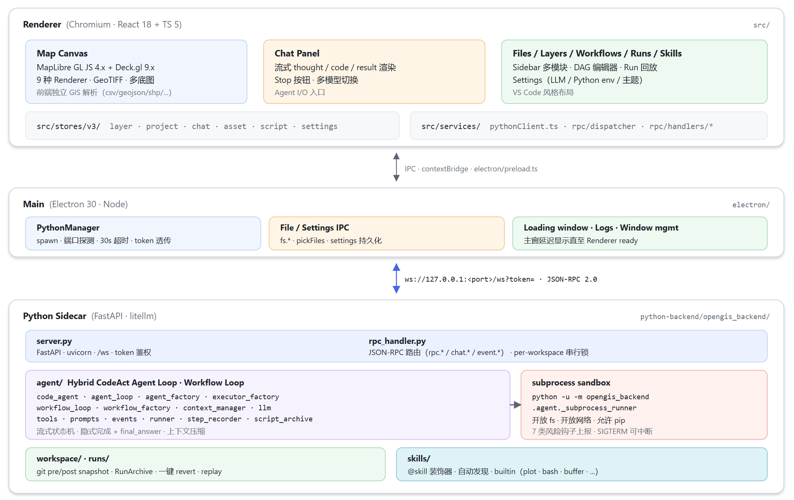
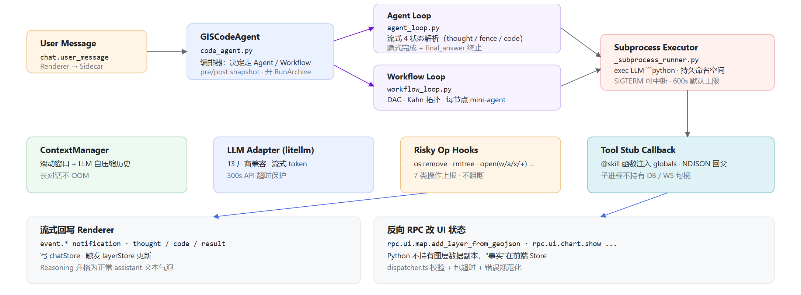

<p align="center">
  
</p>

<h1 align="center">OpenGIS</h1>

<p align="center">
  <strong>Agent 驱动的开源 GIS 桌面应用 — 用自然语言完成地理空间分析</strong>
</p>

<p align="center">
  <a href="#1-介绍">介绍</a> •
  <a href="#2-技术架构">技术架构</a> •
  <a href="#3-快速开始">快速开始</a>
</p>

<p align="center">
  
  
  
  
  
</p>

---

<p align="center">
  <a href="https://www.youtube.com/watch?v=37wGkGV6h2U">
    
    <br>
    
  </a>
</p>

## 1. 介绍


OpenGIS 是一个基于 Agent 的开源 GIS 桌面应用，他可以帮助用户用自然语言完成地理空间分析，目前还在不断迭代优化中，开发时间有限，还望大家理解。同时，这个项目不仅仅是给大家提供一个能用的工具，更多的是给各位 GISer 抛砖引玉。


<p align="center">
  
</p>
<p align="center"><sub>主界面：左侧 Sidebar（Files / Layers / Workflows / Runs / Skills / Settings） · 中间 Map / Code 双栏可分屏 · 右侧 Chat · 底部 DataTable / StatusBar。</sub></p>

<br>
<p align="center">
  
</p>

<br>
<p align="center">
  
</p>

<br>
<p align="center">
  
</p>
<p align="center"><sub>用户要求：根据已有数据对未知数据插值并探索性分析</sub></p>

<br>
<p align="center">
  
</p>

<p align="center"><sub>用户要求：做缓冲区的裁切</sub></p>

<br>
<p align="center">
  
</p>

<p align="center"><sub>用户要求：基于workflow计算流域</sub></p>

### 即将上线

- **强化栅格支持**：完善大尺寸 / 多波段 / 时序栅格的窗口读写、波段运算、重采样。
- **用户自定义 Skills**：开放用户级 skill 目录。
- **地图扩展框架**：已完成基础架构（extension registry + heatmap 扩展），后续支持更多渲染器。
- **学术报告 Workflow**：一键式"数据获取→分析→出图→报告→PDF"全自动流水线。


## 2. 技术架构

### 2.1 进程模型与启动时序

<p align="center">
  
</p>

OpenGIS 是一个标准的 **Electron 三进程 + Python 子进程**结构，但相比传统 Electron 应用多出一层"重计算 sidecar"，并且这个 sidecar 还会再 fork 出代码执行子进程，整体是 **2 + N** 的进程拓扑：

```
Electron Main (Node)
   │ spawn(stdio=pipe)
   ▼
Python Sidecar (FastAPI + uvicorn + litellm)            ← 长驻
   │ spawn(stdio=pipe, NDJSON)
   ▼
Subprocess Runner (python -u -m ..._subprocess_runner)  ← 每个 agent run 一个
```

| 层 | 进程 | 主要职责 | 关键源文件 |
|---|---|---|---|
| Renderer | Chromium / React 18 + TS 5 | UI、地图、Zustand Store、反向 RPC 处理 | `src/features/`、`src/stores/`、`src/services/rpc/`、`src/services/pythonClient.ts` |
| Main | Electron 30 + Node | 窗口、文件 IO、设置持久化、Python 生命周期管理 | `electron/main.ts`、`electron/ipc/pythonManager.ts`、`electron/preload.ts` |
| Sidecar | Python 3.11 + FastAPI + uvicorn + litellm | JSON-RPC 路由、Agent / Workflow 引擎、Tool / Skill / Workspace / Run 归档 | `python-backend/opengis_backend/server.py`、`rpc/handler.py`、`agent/`、`workspace/`、`runs/`、`tools/`、`skills/` |
| Sandbox 子进程 | Python 解释器（per-run） | 真正 exec LLM 写出来的代码 | `python-backend/opengis_backend/agent/execution/subprocess_runner.py` |

启动时序（来自 `pythonManager.ts` + `server.py` 真实代码）：

- **Renderer ↔ Main**：通过 `electron/preload.ts` 的 `contextBridge` 暴露 `window.electronAPI`，传递 `python:*` 事件、`file:*` / `settings:*` 调用；
- **Main ↔ Sidecar**：Main 启动时 `spawn python -m opengis_backend --port <PORT>`，扫描 stdout 中的 `OPENGIS_WS_TOKEN=...` 与 `OPENGIS_READY` 行，30s 启动超时，退出走 `SIGTERM → 5s → SIGKILL`；
- **Renderer ↔ Sidecar**：单条 WebSocket（`ws://127.0.0.1:<port>/ws?token=`），承载双向 JSON-RPC 2.0；token 不匹配立即 `-32001 Unauthorized`。

### 2.2 通信契约

依赖 WebSocket  **JSON-RPC 2.0** 通信

```python
self._method_handlers = {
    "rpc.fs.load_file":               self._handle_load_file,
    "rpc.fs.get_file_info":           self._handle_get_file_info,
    "rpc.skill.list":                 self._handle_skill_list,
    "rpc.skill.execute":              self._handle_skill_execute,
    "rpc.code.run_script":            self._handle_run_script,
    "rpc.code.cancel_script":         self._handle_cancel_script,
    "rpc.agent.interrupt":            self._handle_agent_cancel,
    "rpc.agent.set_llm_config":       self._handle_agent_configure,
    "rpc.agent.test_connection":      self._handle_agent_test_connection,
    "rpc.workspace.revert_run":       self._handle_workspace_revert_run,
    "rpc.workspace.install_templates": self._handle_install_templates,
    "rpc.runs.list":                  self._handle_runs_list,
    "rpc.runs.get":                   self._handle_runs_get,
    "rpc.runs.replay":                self._handle_runs_replay,
    "rpc.debug.set_log_level":        self._handle_set_log_level,
    "rpc.debug.get_log_level":        self._handle_get_log_level,
    "user_instructions.get":          self._handle_ui_get,
    "user_instructions.set":          self._handle_ui_set,
    "chat.user_message":              self._handle_agent_chat,
}
```

三类命名空间各管一段：

| 命名空间 | 语义 | 典型方法 | 前端超时（`pythonClient.ts`） | 流式 |
|---|---|---|---|---|
| `chat.*` | 长任务对话回合 | `chat.user_message` | 10 min | 是（持续吐 notification）|
| `rpc.code.run_script` | 用户手动跑脚本 | `rpc.code.run_script / cancel_script` | 10 min | 是 |
| `rpc.skill.*` | 重 GIS 操作 | `rpc.skill.list / execute` | 5 min | 否 |
| 其他 `rpc.*` | 同步命令 / 查询 | `rpc.fs.* / rpc.runs.* / rpc.workspace.* / rpc.agent.*` | 60 s | 否 |
| 反向 RPC（Python → Renderer） | 让前端做事 | `rpc.ui.map.add_layer_from_geojson` 等 | — | 否 |


**反向 RPC** 是这套架构的关键招式：同一条 WebSocket 既承载 Renderer→Python 的请求，也承载 Python→Renderer 的请求。Python 端通过 `SkillContext.notify_fn` 调 `_safe_notify`，把 `method` + `params` 发回前端；前端 `PythonClient._handleMessage` 看到带 `method` 字段的入站消息就走 `dispatcher.handleNotification` 路由到 `src/services/rpc/handlers/*.ts`。这样 Python 不持有图层句柄，照样能让前端"把这段 GeoJSON 加进 layerStore 并刷新地图"。

**线程安全细节**：sandbox 里的 skill 回调可能跑在 worker thread 上，不能直接 `await ws.send_text`。`_safe_notify` 用 `asyncio.run_coroutine_threadsafe(..., self._loop)` 把发送动作 schedule 回 websocket 所在的事件循环，再 `fut.result(timeout=10)` 等返回，避免跨线程触发 RuntimeError。

**鉴权深度防护**：token 是 sidecar 启动时一次性生成的，Main 进程用正则截 stdout 拿到，再通过 `contextBridge` 暴露给 Renderer。`secrets.token_urlsafe(32)` ≈ 256 bit 熵，加上服务只 listen `127.0.0.1`，构成"绑回环 + 一次性 token"双层防御，杜绝同机其它进程嗅探到端口后挂上来。

### 2.3 Agent 引擎：Function-Call Agent Loop

<p align="center">
  
</p>

Agent 引擎现在按职责拆成 `agent/loop/`、`agent/execution/`、`agent/context/`、`agent/session/`、`agent/telemetry/`、`agent/workflow/` 和 `agent/governance/`。普通对话入口是 `agent/loop/agent_loop.py`，每轮调度由 `agent/loop/turn_runner.py` 和 `agent/loop/loop_kernel.py` 承担；Python 执行、工具 schema、工具运行时在 `agent/execution/` 下集中管理。

#### 2.3.1 为什么以 Function Call 为主

主流 Agent 范式有两条路线：

- **JSON tool call**（OpenAI function calling、Toolformer）——LLM 输出结构化 JSON，框架按 schema 路由到工具；
- **CodeAct**（[Wang et al. 2024](https://arxiv.org/abs/2402.01030)，Claude Code / OpenHands / Cline）——LLM 输出 ` ```python` 代码块，框架直接 exec。

OpenGIS 现在以 function call 为主：工具都有明确 schema、权限、前端展示协议和事件日志。Python 代码执行仍然作为一个受控工具保留，用来覆盖 GIS 长尾分析场景（例如临时安装包、批处理数据、绘图、空间统计），但普通工具调用不再依赖从自然语言里解析代码块。

#### 2.3.2 MessagePart 事件流

后端将模型输出、reasoning、tool call、tool output、Python 代码、artifact、plan、subagent、error 等统一投影为 `MessagePart[]`。前端 Chat 直接渲染 MessagePart，不再从文本 envelope 中推断状态。这样做的目标是让普通回复、工具调用、代码执行、workflow 和 worker 反馈共享同一套展示协议。

#### 2.3.3 一次循环的真实流程

一次完整循环：

1. `context.build_messages(self.system_prompt)` → 拼出本轮 messages（含历史 + 系统 prompt + 必要时压缩过的摘要）；
2. `llm_call(...)` 发起模型请求，流式文本直接进入 MessagePart，function call 进入工具调度；
3. `TurnRunner` 校验工具参数、权限和执行策略；
4. 普通工具由 `ToolRuntime` 调用，Python 代码由 sandbox 子进程执行；
5. 工具结果写回上下文，同时通过事件日志推送给前端；
6. 模型无后续工具调用时，最终文本完成，loop 退出；
7. 每轮结束后检查上下文压缩、记忆投影、脚本归档和 run 事件持久化。

终止条件三选一：**隐式完成 / 显式 `final_answer` / 步数上限**（默认 `DEFAULT_MAX_ITERATIONS=10`，外加 `AGENT_LOOP_SAFETY_MULTIPLIER=2` 安全倍乘 → 实际硬顶 20 步，触顶后 LLM 自己写一段总结）。这个策略和 Claude Code / OpenHands / Cline 完全对齐，不再额外发一次"你完成了吗"的自评估调用，节省一倍 LLM 成本。

#### 2.3.4 上下文压缩与可中断

- **上下文压缩**：`ContextManager.should_compress()` 监控历史 token 数（含 system prompt），触发后调 `self.context.compress(self.llm_call)` —— 让 LLM 自己把过去 N 步压缩成一段摘要（anchored merge：新摘要包含旧摘要，防止无限增长）+ 保留最近 K 步全文 + 永不压缩"持有 artifact 的 tool 结果"（识别 `skill(` 关键字）。CJK 字符使用独立的 1.5 chars/token 估算，避免中文场景下压缩触发太晚；
- **可中断**：`AgentLoop._interrupted` 标志位，每轮顶部检查；外部 cancel 时 `_handle_agent_cancel` 按四步走 —— ① `loop.interrupt()` 设标志位 → ② `executor.interrupt()` 给子进程发信号 → ③ `executor.cleanup()` 杀进程树 → ④ `current_agent_task.cancel()` 取消 asyncio 任务，最后强制释放 workspace lock。Sub-agent 通过 `_active_subagent_tracker` 实现取消传播；
- **调试模式**：Settings → Agent → Debug Mode 开关，通过 `rpc.debug.set_log_level` 运行时切换日志级别。DEBUG 模式下输出 LLM 响应预览、完整代码块、工具调用参数/结果、执行输出等详细信息。

### 2.4 记忆系统

OpenGIS 的记忆分为四层：

| 层 | 持久化位置 | 生命周期 | 说明 |
|---|---|---|---|
| **对话上下文** | `.opengis/contexts/<id>.json` | 跨重启 | 每次 run 结束自动保存 ContextManager，重启后恢复 |
| **项目记忆** | `.opengis/memory.md` | 跨对话 | 自动从 run 结果提取关键信息（文件路径、数据统计、摘要），注入 system prompt |
| **用户指令** | `~/.opengis/user_instructions.md` | 永久 | 用户手动写的全局偏好（语言、代码风格等） |
| **步骤输出** | `.opengis/workflow_steps/*.md` | 永久 | workflow 每步的完整输出，供后续步骤 `read_file` 引用 |

**对话上下文持久化**：`context_persistence.py` 在每次 agent run 结束后将 `ContextManager`（消息历史 + 压缩摘要 + 偏移量）序列化到磁盘。重启后首次对话自动恢复，agent 拥有之前的完整记忆。

**项目记忆自动提取**：`_extract_memory()` 在 run 结束后用正则从最终回答中提取文件路径、关键数字、摘要，写入 `memory.md`。下次对话时注入 system prompt 的 `## Project Memory` 段落，agent 知道之前做过什么。

**Workflow 步骤输出**：`_finalize_step()` 将每步的完整输出写入 `.opengis/workflow_steps/step<N>_<node_id>.md`，只返回结构化摘要（~200 字符）给下游步骤。细节通过 `read_file` 按需读取。

### 2.5 Workflow Loop：DAG 驱动的多步 Agent

`agent/loop/workflow_loop.py` 把"线性聊天 Agent"扩展成"按 DAG 编排的多步 Agent"，workflow 的构建和模型位于 `agent/workflow/`。前端 `WorkflowEditorView` 编辑生成 `.flow.json`，附带到聊天里就自动切换执行模式。

数据结构：

```python
@dataclass
class WorkflowNode:
    id: str
    title: str
    description: str
    node_type: str          # process | input | output | decision
    config: dict            # 步骤参数（前端 params 字段）
    max_retries: int = 3
    hooks: list[dict]       # 验证钩子（解析但尚未评估）
```

执行管线：

1. **解析**：`WorkflowDocument.from_json(raw)` 把 `.flow.json` 解析成 nodes + edges，同时兼容前端 camelCase（`nodeType`/`params`/`maxRetries`）和后端 snake_case（`type`/`config`/`max_retries`）两种字段名；
2. **拓扑**：`topological_sort()` 走 Kahn 算法，遇到环抛 `ValueError`；
3. **节点提示**：`build_step_prompt()` 给每个节点造聚焦提示，含用户原始诉求、节点描述、前驱节点摘要；
4. **节点执行**：`_execute_node()` 跑 mini-agent loop，支持多代码块 + nudge 机制（纯文本回复时推 LLM 继续写代码）+ LLM 重试（指数退避）；
5. **步骤摘要**：`_finalize_step()` 将完整输出写入 `.opengis/workflow_steps/*.md`，返回结构化摘要（文件路径 + 关键数字），减少 context 膨胀；
6. **主动压缩**：每步结束后检查 context 大小，超阈值立即压缩；
7. **结果传递**：上游节点的摘要作为 `predecessor_outputs` 注入下游 prompt；
8. **Compact UI**：workflow 执行时前端只显示 PlanRow 进度卡片，抑制详细的 code/tool/thinking 消息；
9. **失败即停**：`halt_on_failure` 选项可在节点失败时立即终止 workflow。

### 2.6 子进程沙箱：开放、可观察、可中断、可回滚

> 设计哲学（与 Claude Code / OpenHands 同一血脉）：**不靠白名单，靠"开放 + 观测 + 兜底"**。fs、网络、`pip install` 全开，安全网由"workspace git snapshot + Stop 按钮 + 风险操作上报"三件套构成。

#### 2.5.1 进程级隔离：父子双向 NDJSON

sidecar 主进程**不**直接 `exec()` LLM 写的代码。每个 agent run 都 fork 一个 `python -u -m opengis_backend.agent._subprocess_runner` 子进程，父子通过 stdin/stdout 跑一套**双向 NDJSON 协议**（每行一个 JSON 对象）：

```
父 → 子 (stdin)                        子 → 父 (stdout)
  init   {tool_names, ...}              ready
  set_var{name, value}                  stdout {text}
  exec   {code}                         tool_call {call_id, name, args, kwargs}
  tool_result {call_id, ok, value}      done {ok, output, is_final_answer, logs}
  shutdown                              risky_op {op, path, extra}
```

这样几个好处：

- **子进程崩溃 ≠ sidecar 崩溃**——LLM 写一段死循环 / `os._exit(1)` / `MemoryError` 都只杀子进程；
- **子进程持久状态**——同一个 run 内多次 exec 共用 globals，`gdf = gpd.read_file(...)` 然后下一个 cell 直接 `print(gdf.head())` 像 Jupyter 一样工作；
- **资源边界清晰**——子进程不持有 WebSocket、数据库句柄、SkillRegistry，纯当"代码运行宿主"。

#### 2.5.2 Tool stub：远程回调而非真函数

子进程里的 `final_answer(...)` 和每个 `@skill` 装饰过的函数都不是真函数，而是 `_make_tool_stub()` 生成的"远程调用桩"：

```python
def stub(*args, **kwargs):
    call_id = uuid.uuid4().hex
    _emit({"kind": "tool_call", "call_id": call_id, "name": name,
           "args": list(args), "kwargs": kwargs})
    while True:
        msg = _read_message()
        if msg.get("kind") == "tool_result" and msg.get("call_id") == call_id:
            if msg.get("ok"): return msg.get("value")
            raise RuntimeError(f"Tool '{name}' failed: {msg.get('error')}")
```

子进程发 `tool_call` → 父进程收到后真正执行（持有 SkillContext、能调反向 RPC） → 回 `tool_result`。`final_answer` 比较特殊，stub 直接 `raise _FinalAnswer(value)`（继承自 `BaseException`，绕过用户的 `except Exception:`），用异常 unwind 出 `exec()`，再被父进程翻译成 `is_final_answer=True`。

#### 2.5.3 风险钩子：观察不阻断

`_install_risky_op_hooks()` monkey-patch 7 类写效果操作，每次调用都发一条 `risky_op` 给父进程，最终落进 `meta.json.risky_ops`：

| 类别 | 被 patch 的符号 |
|---|---|
| 删除 | `os.remove` · `os.unlink` · `shutil.rmtree` · `pathlib.Path.unlink` |
| 写文本 / 字节 | `pathlib.Path.write_text` · `pathlib.Path.write_bytes` |
| 打开写模式 | `builtins.open(mode in {"w","a","x","+"})` |

**只观察、不阻断**——LLM 想 `rm -rf workspace/*` 也能跑，但每条都留痕，加上 §2.7 的 git snapshot 即可一键还原。这是和"传统沙箱白名单"的根本分野。

#### 2.5.4 matplotlib 兼容

`_install_pyplot_patch` 解决两个老坑：

- **半初始化崩溃**——matplotlib 在子进程里某些后端（macOS 的 macosx、Linux 的 Qt）首次 import 会触发 "Cannot find a backend" 或递归 init，用一个**重入计数器**保证只走一次安全初始化；
- **figure 父进程取不到**——`_make_local_save_plot` 把 `plt.savefig(...)` 拦截到 sidecar 共享目录，父进程通过 `plot` skill 的反向 RPC 把图片回传给前端。

#### 2.5.5 单 run 预算与并发锁

- **per-run timeout**：`SubprocessExecutorConfig.exec_timeout`，默认 600s（`DEFAULT_EXEC_TIMEOUT`），最大 3600s（`MAX_EXEC_TIMEOUT`）、最小 1s（`MIN_EXEC_TIMEOUT`），见 `runtime/constants.py`；
- **per-workspace 串行锁**：`rpc/handler.py` 里 `_workspace_locks: dict[str, str]`（workspace_path → owner run_id），新请求若发现该 workspace 已有活跃 run，直接返回 `{"status": "busy", "owner_run_id": ...}` 而不是排队，避免 cwd / archive 目录竞态；
- **真杀进程树**：cancel 走 `executor.interrupt()` → `executor.cleanup()`，Windows 走 `CTRL_BREAK_EVENT` + `taskkill /F /T /PID`，POSIX 走 `SIGTERM → 5s → SIGKILL`，确保子进程的子进程（`pip install` fork 出的 build worker 之类）也一起清掉。

### 2.7 Workspace + Run：事中可中断 + 事后可回滚

开放沙箱要敢开，必须要有兜底。OpenGIS 用 git 做这一层：

#### 2.6.1 WorkspaceManager：双 SHA snapshot

每个 agent run 的开头和结尾，`WorkspaceManager` 各打一次 git snapshot：

```
run 开始 ──► pre_sha  = git stash create / git rev-parse HEAD
   …agent 跑代码、可能改动 .shp / .geojson / 中间产物…
run 结束 ──► post_sha = git stash create / git rev-parse HEAD
```

两个 SHA 写进 `.opengis/runs/<run_id>/meta.json`。如果 workspace 还不是 git 仓库，首次 run 时懒初始化（`git init` + 一次 baseline commit）。

#### 2.6.2 RunArchive：每个 run 单独归档

每个 run 在 `.opengis/runs/<run_id>/` 下产出：

```
meta.json        # prompt / pre_sha / post_sha / status / step_count / risky_ops / 时间戳
stdout.txt       # 子进程整段 stdout（含 print/log）
steps/
  step_1.py      # LLM 写出来的源代码
  step_1.json    # 该步的 thought / output / error / duration
  step_2.py
  ...
```

对应的查询 API：

| 方法 | 用途 |
|---|---|
| `rpc.runs.list` | 列出某 workspace 下最近 N 个 run |
| `rpc.runs.get` | 取单个 run 的 meta + steps |
| `rpc.runs.replay` | 拿历史 run 的原始 prompt 在当前模型上重跑（产生**新** run，原归档不可变）|

#### 2.6.3 一键 revert

`rpc.workspace.revert_run` 走 `_handle_workspace_revert_run`：

```python
ra = RunArchive.load(workspace, run_id)
pre_sha = ra.meta.get("pre_sha")
self._workspace_manager.reset_hard(workspace, pre_sha)   # git reset --hard <pre_sha>
return {"status": "ok", "reset_to": pre_sha, "run_id": run_id}
```

带一个安全检查：若该 workspace 当前还有活跃 run，拒绝 revert（`{"status":"busy"}`），强制用户先 Stop。

事中（Stop 按钮真杀进程树）+ 事后（revert 一键回滚）= **开放沙箱模型下的完整双重安全网**。

### 2.8 Skill 系统

`skills/` 提供三件套：`@skill` 装饰器 + `SkillRegistry`（启动时 `discover_and_load()` 自动扫描 `builtin/` 目录）+ `SkillContext`（持有 `notify_fn` / `conversation_id` / `meta`）。

**分组机制**：每个 skill 有 `group` 字段（`core` / `qgis` / `osm` / `datasource` / `report`），用户通过 AttachPanel 按组挂载，agent 只看到已挂载的 skill。

内置 skills（`skills/builtin/`，50+ 个）：

| 分组 | Skill | 作用 |
|---|---|---|
| **core** | `bash` | 受控 shell 调用 |
| | `read_file` / `write_file` / `edit_file` | 文件 IO（edit_file 支持精确字符串替换） |
| | `glob` / `grep` | 工作区搜索 |
| | `plot` | matplotlib 图像生成并回传前端 |
| | `display`（add_layer / zoom_to_layer / set_basemap / ...） | 地图图层管理（**反向 RPC**） |
| | `buffer` / `csv_to_geojson` | 空间分析工具 |
| | `update_plan` | 任务计划管理（PlanRow UI） |
| | `run_subagent` / `run_subagents` | 子 agent 委托（串行 / 并行） |
| | `list_extensions` | 查询已注册的地图扩展 |
| **qgis** | `qgis_call` | QGIS MCP 命令（30+ 子命令） |
| **osm** | `osm_call` | OpenStreetMap 数据下载（Overpass API） |
| **datasource** | `datasource_call` | 预置 GeoJSON 数据目录（行政区划、Natural Earth 等） |
| **report** | `export_map_snapshot` | 地图截图（自动切到地图 tab） |
| | `interactive_snapshot` | 阻塞式地图截图（用户手动调整后确认） |
| | `write_report_section` | 逐章节写 Markdown 报告 |
| | `export_report_pdf` | Markdown → PDF（pandoc / mdpdf / weasyprint） |
| | `academic_polish` | 学术文本润色（中英文） |
| | `academic_translate` | 学术中英互译 |
| | `academic_grammar_check` | 语法检查 |
| | `generate_abstract` | 生成摘要 |
| | `format_references` | 参考文献格式化（APA / MLA / Chicago / GB/T 7714） |
| **ext** | `ext_heatmap_render` / `ext_heatmap_remove` | MapLibre GPU 热力图（**反向 RPC**） |

**关键设计：每个 skill 都是薄包装，本质是反向 RPC**。Python 不持有图层数据副本，所有"事实"都在 Renderer 的 Zustand Store。地图状态唯一可信源在前端，Python 只是个"能写代码、能调 GIS 库、能远程指挥前端"的执行者——这条原则让重启 sidecar 不会丢图层、让 Renderer 离线时仍能用前端 parser 加载本地 GIS 文件（见 §2.9）。

新 Skill 通过把 `.py` 放进 `python-backend/opengis_backend/skills/builtin/` 即被自动发现，写法：

```python
from opengis.skill import skill, SkillContext

@skill(name="my_analysis", description="自定义空间分析")
def my_analysis(ctx: SkillContext, input_layer_id: str, radius: float) -> dict:
    # 你的逻辑
    # 反向 RPC：让前端做事
    await ctx.notify("rpc.ui.map.add_layer_from_geojson", {...})
    return {"layer_id": ...}
```


### 2.9 技术栈一览

| 层 | 技术 | 用途 |
|---|---|---|
| 桌面壳 | Electron 30.x | 跨平台桌面 |
| 前端 | React 18 + TypeScript 5 | UI |
| 构建 | Vite 5 + electron-vite | 三入口（main / preload / renderer）HMR + 打包 |
| 地图 | MapLibre GL JS 4.x | WebGL 渲染 |
| 状态 | Zustand 4.x | 轻量状态管理 |
| 样式 | Tailwind CSS 3.x | utility-first |
| 编辑器 | Monaco Editor | 代码查看 / 编辑 / 重跑 |
| 后端 | Python 3.11+ / FastAPI / uvicorn | Agent 引擎 + GIS 处理 |
| LLM 适配 | Vercel AI SDK（前端）+ litellm（后端） | 多模型适配 |
| GIS 内核 | GDAL / GeoPandas / Rasterio / Fiona / Shapely / pyproj | 地理空间 IO |
| 绘图 | Matplotlib / Seaborn / Contextily | 统计图表 + 底图渲染 |
| 通信 | WebSocket + JSON-RPC 2.0 | 前后端双向 |
| 安全网 | Git（per-workspace）+ NDJSON 子进程协议 + Token 鉴权 | snapshot / 隔离 / 鉴权 |

---

## 3. 快速开始

### 3.1 前置依赖

| 依赖 | 版本 | 必需 |
|---|---|---|
| Node.js | ≥ 18.x | 是 |
| Python | ≥ 3.11 | 是（需含 `venv` 模块） |
| Git | 任意 | 是（workspace snapshot 依赖）|
| LLM API Key | OpenAI / Claude / DeepSeek / MiniMax / GLM / Ollama 任一 | AI 功能必需，GIS 核心能力不需要 |

### 3.2 克隆仓库

```bash
git clone <repo-url>
cd OpenGIS
```

### 3.3 安装前端依赖

```bash
npm install
```

### 3.4 安装 Python backend

项目使用自带的 `.venv` 运行 Python 后端，无需手动管理环境：

```bash
npm run setup:python
```

该命令会自动完成：
1. 在 `python-backend/` 下创建 `.venv` 虚拟环境
2. 安装所有 Python 依赖（FastAPI、uvicorn、GeoPandas、Rasterio 等）

应用启动时会自动检测并使用 `python-backend/.venv/bin/python`，无需任何额外配置。

> 注意：Windows / macOS 下 GDAL / Fiona / Rasterio 需要预编译 wheel 或系统级 C 库。如果安装失败，可以尝试先用 conda 装原生库再运行 setup：
>
> ```bash
> conda install -c conda-forge geopandas rasterio fiona pyproj shapely -y
> npm run setup:python
> ```

### 3.5 启动 dev 模式

```bash
npm run dev:electron
```

会一气呵成做三件事：
1. 启 Vite dev server（renderer HMR）；
2. 编译 `electron/` 下的 main + preload；
3. 拉起 Electron 窗口，自动 spawn Python sidecar。

看到窗口 + 状态栏显示 **"Python: ready"** 即启动成功。

### 3.6 配置 LLM

侧边栏齿轮图标打开设置 → **Model** 页。

**快速配置**：在 Provider 下拉菜单中选择你的 AI 服务商（如 DeepSeek、OpenAI、Ollama 等），系统会自动填充 Protocol 和 Base URL，你只需填写 API Key 和 Model Name。

需要填的字段：

| 字段 | 说明 | 示例 |
|---|---|---|
| **Provider** | AI 服务商，自动填充协议和端点 | DeepSeek / OpenAI / Anthropic / Ollama 等 24 个预设 |
| **Protocol** | 协议类型（选择 Provider 后自动填充） | `OpenAI Compatible` / `Anthropic Compatible` |
| **API Key** | 你的密钥，仅本地保存 | `sk-...` |
| **Base URL** | API 端点 URL（选择 Provider 后自动填充） | `https://api.deepseek.com` |
| **Model Name** | 具体模型 ID | `deepseek-v4-pro` / `gpt-4o` / `claude-sonnet-4-5` |

填完点 **Test Connection** 验证 200 OK；保存后随便发一句"你好"，看到流式回复即代表全链路通了。

**预设保存**：配置好一组参数后，可以通过底部的 **Save** 按钮保存为预设。下次切换时直接点击预设卡片即可一键填充所有字段，无需重复输入。

> 协议层面的对应关系：所有走 OpenAI 协议的服务（DeepSeek / Moonshot / GLM / MiniMax / 阿里百炼 / Ollama / vLLM / one-api / 各类中转）都选 `OpenAI Compatible`；Anthropic 官方和兼容 Anthropic Messages 协议的网关选 `Anthropic Compatible`。

### 3.7 打开工作区

菜单 **File → Open Workspace** 选一个目录作为工程文件夹，首次打开会懒创建 `.opengis/` 元数据子目录（`runs/` / `scripts/` / `conversations/` 等）。

## 许可

本项目采用 **MIT License**，详见 [LICENSE](LICENSE)。

---
