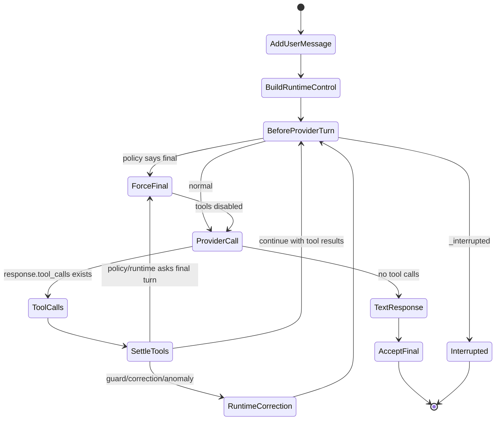

# OpenGIS Agent Loop 及其终止条件技术报告

生成日期：2026-07-12  
代码基线：OpenGIS `dev` 分支当前工作区  
报告对象：OpenGIS 后端 Agent loop、Workflow loop、ToolRuntime、Session/Run 生命周期及终止条件

---

## 1. 摘要

OpenGIS 当前的 Agent 架构已经从早期 CodeAct 风格迁移到 **function-call-first** 架构。核心变化是：模型输出不再被当作可执行协议解析，所有可执行动作都必须以结构化 function tool call 形式出现；普通文本只作为最终回复、解释或 workflow 节点摘要，不会再被执行为 Python。

当前主 loop 可以概括为：

```text
chat.user_message
  -> RpcHandler
  -> OpenGISAgent.run()
  -> build_agent_loop() / build_workflow_loop()
  -> AgentRunner.drive()
  -> AgentLoop.run() / WorkflowLoop.run()
  -> LoopKernel.run_turn()
  -> LLM provider call
  -> ToolCallSettler / ToolRuntime
  -> ContextManager append tool result
  -> next provider turn or final text
  -> RunArchive / Session finalization
```

OpenGIS 的终止条件不是单一的“最大步数”或“关键词判断”，而是多层组合：

| 层级 | 终止机制 | 作用 |
|---|---|---|
| Provider 语义层 | LLM 返回无 tool call 的文本 | free-form chat 的正常完成路径 |
| Loop policy 层 | profile metadata 中的 provider/tool/code/work step budget | 计划、探索、workflow、subagent 等受限 profile 的硬边界 |
| RuntimeControl 层 | worker 已验证、分析已足够、重复失败、目标偏离等 | 防止 loop 跑偏或陷入重复工具路径 |
| Workflow DAG 层 | 所有节点完成、节点错误预算耗尽、节点迭代上限、halt_on_failure | workflow 专用收敛 |
| 取消层 | `rpc.agent.interrupt`、WebSocket disconnect、task cancel | 用户或连接生命周期终止 |
| 执行层 | Python subprocess timeout / child death / cleanup | 防止代码执行卡死 |
| 请求预算层 | provider request token pressure、context compression、tool result prune | 防止上下文过大导致请求不可控 |
| 外层生命周期 | RunArchive close、SessionStore finish、workspace lock release | 保证 UI/状态最终一致 |

总体判断：OpenGIS 当前 loop 已经具备主流 Agent runner 的基本形态：稳定 tool surface、事件化 run、context projection、权限治理、subprocess 执行隔离、workflow DAG、session coordinator 和 cancellation chain。当前仍需重点关注的不是“是否有终止条件”，而是 **不同终止信号之间的优先级、可观测性和前端状态一致性**。

---

## 2. 当前 Agent 架构分层

### 2.1 入口层：RPC 与队列

用户消息从前端进入 `RpcHandler`：

- 直接聊天入口：`chat.user_message`
- 队列入口：agent queue / inbox
- 取消入口：`rpc.agent.interrupt`
- workflow 附件或 profile 会改变后续 loop 类型

关键源码：

```text
python-backend/opengis_backend/rpc/handler.py
python-backend/opengis_backend/agent/open_gis_agent.py
python-backend/opengis_backend/agent/session/session_coordinator.py
python-backend/opengis_backend/agent/session/run_session.py
```

`RpcHandler` 负责：

1. 构造 `ToolContext`，注入 workspace、conversation、approval callback、inbox id。
2. 创建或恢复 queue item。
3. 调用 `OpenGISAgent.run()`。
4. 将 `AgentEvent` 转成前端 `MessagePart` 或 chat notification。
5. 在取消、异常、完成时更新 inbox / workspace lock。

`SessionCoordinator` 负责进程内同一 conversation/session 的互斥：

```text
SessionCoordinator.acquire(key, run_id)
SessionCoordinator.release(key, run_id)
```

这可以避免同一个会话同时跑两个 loop 并互相污染上下文、工具状态和前端消息流。

### 2.2 Orchestrator 层：OpenGISAgent

`OpenGISAgent.run()` 是 Agent 运行的总编排器。它并不直接执行每一步推理，而是负责准备运行环境：

```text
OpenGISAgent.run()
  -> 选择 shared ContextManager
  -> 初始化 workspace / git snapshot
  -> 创建 ScriptArchive
  -> 创建 AgentSession
  -> 打开 RunArchive
  -> 创建 AgentRunCallbacks
  -> build_agent_loop() 或 build_workflow_loop()
  -> SessionCoordinator.acquire()
  -> AgentRunner.drive()
  -> cleanup / knowledge extraction / archive close
```

它维护几个关键 live handle：

| 字段 | 用途 |
|---|---|
| `current_executor` | 当前 Python subprocess executor，用于取消和 cleanup |
| `_current_loop` | 当前 AgentLoop / WorkflowLoop，用于 `interrupt()` |
| `_current_runner` | 当前 AgentRunner，用于注入 KeyboardInterrupt 打断阻塞 LLM call |
| `_context_store` | conversation + workspace 维度的上下文持久化 |

### 2.3 构建层：AgentFactory / FactoryCommon

`build_agent_loop()` 和 `build_workflow_loop()` 通过 `build_loop_runtime_bundle()` 组装运行时：

```text
ToolRegistry
  -> tools.list_registered()
  -> profile/tool_groups filtering
  -> filter_agent_tools()
  -> build_tool_callables()
  -> build_tool_schemas()
  -> build_llm_caller()
  -> build_subprocess_executor()
  -> PermissionRuntime
  -> ToolRuntime
  -> compose_system_prompt()
```

这层的关键设计是：**工具可见性是 profile 契约，不再按每轮关键词动态裁剪**。`ToolMaterializer` 当前只做去重和 profile 内稳定暴露，token 压力通过 context projection / tool result compression 解决，而不是让工具在同一任务中突然消失。

### 2.4 LoopKernel 层：一个 provider turn 的执行内核

`LoopKernel` 是当前 function-call 架构的核心机械层。它只负责“跑一轮”，不决定整个任务什么时候结束。

单轮流程：

```text
LoopKernel.run_turn(request)
  -> context.should_compress()
  -> RequestBudgetManager.suggest_limits()
  -> ContextManager.build_messages()
  -> ToolMaterializer.materialize()
  -> format_active_tool_prompt()
  -> RequestBudgetManager.analyze()
  -> if hot/overflow: prune_tool_results() and rebuild messages
  -> ProviderTurnCaller.call()
  -> if tool_calls:
       ContextManager.add_assistant_with_tool_calls()
       RuntimeControl.guard_tool_calls()
       ToolCallSettler.settle_all()
       ContextManager.add_tool_result()
  -> return LoopTurnOutcome
```

LoopKernel 不直接“while 到结束”，这点很重要。它只是 AgentLoop / WorkflowLoop 的共享执行内核，避免自由聊天和 workflow 分别复制 provider call、tool settle、telemetry、context budget 等逻辑。

---

## 3. Free-form AgentLoop 状态机

### 3.1 主状态机

`AgentLoop.run()` 是普通对话的主 loop。其状态机可以表达为：



### 3.2 正常完成路径

普通 AgentLoop 的最核心终止条件是：

> LLM 在某一轮 provider call 中没有返回 tool call，而是返回普通文本。

对应逻辑：

```text
if tool_calls:
    settle tools
    continue
else:
    context.add_assistant_message(response)
    emit final text
    return response
```

这意味着在 free-form chat 中，**文本即终止**。只要模型不再要求工具，Runner 就把该文本接受为最终回答。这是 function-call agent 的主流闭环方式：模型通过 tool call 表达“我还要行动”，通过 text 表达“我完成了/我要回复用户”。

### 3.3 工具调用后的继续路径

当 LLM 返回 tool calls：

1. `LoopKernel` 将 assistant tool calls 写入上下文。
2. `ToolCallSettler` 逐个执行工具。
3. 工具结果作为 `tool` role 消息写回上下文。
4. `AgentLoop` 增加 `code_steps` / `tool_steps`。
5. `RuntimeControl.observe_settlements()` 观察工具结果。
6. 若无强制最终或纠偏，则 `continue`，让下一轮 LLM 读取工具结果。

因此 tool call 本身不是终止点，而是一个“动作结算点”。真正终止仍需要下一轮 provider 产出无 tool call 的文本，或者 policy/runtime 要求进入 final turn。

### 3.4 Final turn

当 `LoopPolicy` 或 `RuntimeControl` 设置 `force_final_reason` 后，下一轮 provider call 会带上：

```text
## Runner Final Step
Reason: <reason>.
Tools are disabled for this provider turn.
Do not call tools.
Give the user a concise final answer...
```

同时 `LoopKernel` 将 active tools 设置为空：

```text
disable_tools=True
active_tool_schemas=[]
```

如果 provider 在 tools disabled 的 final turn 里仍然返回 tool call，系统会丢弃这些 tool calls，并生成一段预算/停止提示文本作为兜底。这是防止“到了终止边界但模型仍继续行动”的保险丝。

---

## 4. 终止条件总表

### 4.1 Free-form AgentLoop 终止条件

| 条件 | 触发位置 | 结果 | 说明 |
|---|---|---|---|
| LLM 返回文本且无 tool call | `AgentLoop.run()` | `return response` | 普通聊天最主要完成路径 |
| 外部中断 `_interrupted=True` | loop 每轮开头 | 返回 `(Task interrupted by user.)` | 用户取消或 WebSocket disconnect |
| policy 触发 final turn | `LoopPolicy.before_provider_turn()` | 下一轮禁用 tools，然后文本终止 | 由 profile metadata 控制 |
| RuntimeControl 触发 final turn | `observe_settlements()` | 下一轮禁用 tools，然后文本终止 | worker verified / analysis ready 等 |
| tool visibility miss retry 后仍文本 | `AgentLoop.run()` | 第二次按文本接受 | 只 retry 一次全工具暴露 |
| LLM call 异常超出 retry | `ProviderTurnCaller` / `AgentRunner` | ERROR + STREAM_END | 网络/供应商错误 |
| Python subprocess timeout/death | `SubprocessPythonExecutor` | tool error，可能继续或最终报错 | 单次 exec 默认 600s |
| asyncio task cancelled | `AgentRunner.drive()` / `RpcHandler` | cancelled 状态 | 外层任务取消 |

### 4.2 LoopPolicy 硬预算

`LoopPolicy` 从 `AgentProfile.metadata` 读取预算：

| 字段 | 含义 |
|---|---|
| `max_provider_turns` | 最大 provider call 轮数 |
| `max_code_steps` | 最大代码执行步数 |
| `max_tool_steps` | 最大非代码工具结算数 |
| `max_work_steps` | `code_steps + tool_steps` 总工作步数 |

当前默认 profile：

| Profile | 默认约束 |
|---|---|
| `gis-build` | metadata 为空，即默认不设固定最大步数 |
| `gis-plan` | provider/tool/work 约束较小，偏只读计划 |
| `gis-explore` | 有限探索，限制代码和工具步数 |
| `workflow-runner` | 有 `max_provider_turns` |
| `gis-subagent` | 有 `max_provider_turns` |

这体现了一个重要设计：**默认 GIS build agent 不靠硬步数截断复杂任务；受限 profile 才通过 metadata 设预算。**

### 4.3 RuntimeControl 软控制与收敛

`RuntimeControl` 是当前 OpenGIS 防跑偏的主要层。它不是 workflow 引擎，而是每个 user turn 的目标约束器。

它会创建：

```text
TurnObjective(
  user_request=<用户原文>,
  mode=<TaskMode>,
  constraints=(...)
)
```

当前 TaskMode 包括：

| Mode | 典型场景 |
|---|---|
| `GENERAL` | 普通对话 |
| `OPERATION_REPAIR` | 修复 operation |
| `OPERATION_RUN` | 运行 operation |
| `MAP_RENDERING` | 地图/图层/样式 |
| `DATA_ANALYSIS` | 分析、统计、评价 |
| `WORKFLOW` | workflow |
| `WORKER` | 常驻 worker |

RuntimeControl 的终止/纠偏信号：

| 信号 | 行为 |
|---|---|
| `worker_running_verified` | worker 工具成功且健康，强制 final turn |
| `analysis_answer_ready` | 数据分析已有足够输出且用户未要求图表/文件/地图，强制 final turn |
| operation 失败后未修复 | 注入 correction，禁止绕过 operation 自己写一次性脚本 |
| tool 返回 structured failure 且不可重试 | 注入 correction，要求改变输入或解释 blocker |
| map churn | 检测重复 remove/add/style 图层，注入 anomaly correction |
| repeated failure | 相同工具连续失败，注入 anomaly correction |
| confirm_map_load pending intent | 用户回答“ok”时，把短确认改写为上一步的加载地图目标 |

RuntimeControl 的关键价值是把“当前 turn 的目标”显式放进 system prompt，并在工具结算后检查偏航。

---

## 5. WorkflowLoop 终止条件

WorkflowLoop 与普通 AgentLoop 不同。它不是开放式 while，而是 DAG 驱动：

```text
WorkflowDocument
  -> topological_sort(nodes, edges)
  -> for each node:
       build_step_prompt()
       _execute_node()
       write_step_output()
       summarize_step_output()
       emit plan update
  -> _generate_workflow_summary()
```

### 5.1 Workflow 总体终止

| 条件 | 结果 |
|---|---|
| DAG 拓扑排序失败 | 返回 `Workflow DAG error` |
| 所有节点完成 | 进入最终 summary provider turn |
| 外部 interrupt | 返回 `(Workflow interrupted by user.)` |
| `halt_on_failure=True` 且节点失败 | workflow 停在失败节点 |

### 5.2 单节点终止

每个 node 内部有一个 mini loop：

```text
max_iterations = (node.max_retries or max_retries_per_node) * 3
max_errors = node.max_retries or max_retries_per_node
```

单节点终止条件：

| 条件 | 结果 |
|---|---|
| tool calls 成功后 LLM 返回文本 | 节点完成，写 step output |
| `output` / `decision` 节点直接返回文本 | 可接受为节点完成 |
| 文本过早出现且未做工具 | 注入 nudge，让模型调用工具 |
| tool error 达到 `max_errors` | 节点失败 |
| 迭代达到 `max_iterations` | 节点 iteration limit |
| `_interrupted=True` | 节点中断 |

WorkflowLoop 与 AgentLoop 最大差异是：WorkflowLoop 仍使用 `decide_text_continuation()` 做“文本是否过早”的判断，而普通 AgentLoop 已移除这种 heuristic nudge，采用更纯粹的 function-call 终止语义。

---

## 6. Tool call 结算与终止关系

### 6.1 ToolRuntime

`ToolRuntime` 是工具执行的统一入口。它负责：

- 解析 function arguments。
- 校验 execute_code payload。
- 权限判断。
- 调用真实 tool callable。
- 归一化输出。
- 截断或物化大输出。
- 记录 tool result。
- 将执行结果反馈给 context。

工具执行结果不会直接让 loop 结束；它只会形成下一轮 LLM 的 observation。loop 是否终止由下一轮 LLM 文本、policy、runtime control 或异常决定。

### 6.2 execute_code 特殊性

Python 代码执行是一个 tool，而不是 loop 协议。它通过 `SubprocessPythonExecutor` 跑在子进程中：

```text
execute_code tool
  -> ToolRuntime
  -> executor_call(code)
  -> SubprocessPythonExecutor.__call__()
  -> child process exec
  -> CodeExecResult
```

重要约束：

- Markdown 代码块不会被执行。
- 只有 `execute_code` function call 的 `code` 参数会执行。
- Python 子进程在同一次 run 内复用，保留 imports / variables。
- 单次 exec 默认 600s timeout。
- cleanup 会关闭子进程，避免 run 结束后代码继续跑。

### 6.3 XML-ish tool call 兜底

部分 OpenAI-compatible provider 可能把 tool call 以文本形式输出：

```text
<tool_call><function=execute_code>...</tool_call>
```

OpenGIS 在 `llm.py` 的 `_extract_xmlish_tool_calls()` 中做边界修复：

- 如果 provider 没有填充 `message.tool_calls`，但 content 内出现 XML-ish tool_call。
- LLM 边界会将其转为 OpenAI-style `tool_calls`。
- 清理 assistant content，避免 `<tool_call>` 被渲染成普通回答文本。

这属于 provider adapter 层兜底，目的不是回到 CodeAct，而是把 provider 的错误输出归一化为 function-call 协议。

---

## 7. Context、Memory 与请求预算对 loop 的影响

### 7.1 ContextManager

ContextManager 存储 conversation 中的 system/user/assistant/tool 消息，并在每轮 provider call 前构造 provider request。

当前设计重点：

- 保留 recent turns。
- 对 tool result 做压缩/裁剪。
- 注入 working state。
- 注入 projected memory。
- 在 token pressure 下主动压缩。

### 7.2 RequestBudgetManager

`RequestBudgetManager` 面向完整 provider request，而不是只看历史消息。它统计：

| Section | 内容 |
|---|---|
| `system` | 主系统提示词 |
| `runtime` | 当前 turn objective、active tools、runner correction |
| `memory` | 检索出的项目记忆 |
| `working_state` | 当前工作状态 |
| `history` | 对话历史 |
| `tool_observation` | 工具返回 |
| `tool_schema` | function tool schemas |
| `output_reserve` | 输出预留 |

压力级别：

```text
ok -> warm -> hot -> overflow
```

当压力为 `hot` 或 `overflow` 且可裁剪时，LoopKernel 会调用：

```text
context.prune_tool_results()
context.build_messages(...rebuild...)
```

这不是终止条件，但会显著影响 loop 是否能继续：它防止 provider request 因工具输出或上下文过大而失败。

### 7.3 MemoryStore / ContextProjector

系统提示词生成时会调用 `ContextProjector(workspace).project(current_user_message)`，按当前任务检索项目记忆。

run 结束时 `_context_store.extract_knowledge_after_run()` 会从 RunArchive 提取：

- facts
- recipes
- dataset cards
- failure memory

这些会影响后续 turn 的 loop 行为，尤其是 repeated failure、operation repair、dataset field 等场景。

---

## 8. 取消、超时与异常终止

### 8.1 用户取消

用户取消入口：

```text
rpc.agent.interrupt
  -> RpcHandler._handle_agent_cancel()
```

取消链路：

```text
subagent_tracker.cancel_all()
current_loop.interrupt()
current_executor.interrupt()
current_executor.cleanup()
current_runner.interrupt_worker_thread()
current_agent_task.cancel()
release workspace lock
```

这是一条多层取消链：

1. 子 Agent 分支先取消。
2. 主 loop 设置 `_interrupted=True`。
3. Python subprocess 收到 SIGINT / CTRL_BREAK_EVENT，必要时 terminate/kill。
4. LLM 阻塞线程通过 `PyThreadState_SetAsyncExc(... KeyboardInterrupt)` 尝试打断。
5. asyncio task cancel。
6. workspace lock 释放。

### 8.2 WebSocket disconnect

`RpcHandler` 在连接断开时也会尝试调用 agent cancel 和 script runner cancel。这可以避免前端关闭或刷新后后端还继续跑一个不可见的 Agent。

### 8.3 Python 执行 timeout

`SubprocessPythonExecutorConfig.exec_timeout` 默认 600 秒。单次 exec 超时后：

```text
_recv(deadline)
  -> timeout
  -> interrupt()
  -> raise ExecTimeout
```

ExecTimeout 通常体现为 tool error，而不是立即杀死整个 AgentLoop。后续是否继续取决于 LLM、RuntimeControl 和错误预算。

### 8.4 LLM call timeout / retry

LLM 层默认 timeout 为 300 秒，retry policy 为：

```text
LLM_MAX_RETRIES = 3
```

ProviderTurnCaller 会在 retryable exceptions 上重试。重试耗尽后异常抛到 AgentRunner，最终产生：

```text
AgentEventType.ERROR
AgentEventType.STREAM_END
```

### 8.5 RunArchive 与 Session 收口

无论 success、error、cancelled，`OpenGISAgent.run()` 的 cleanup 都会尝试：

```text
executor.cleanup()
context_store.persist()
extract_knowledge_after_run()
finish_run_session()
post-run git snapshot
run_archive.close(status=...)
SessionCoordinator.release()
```

这保证了即使 loop 异常退出，状态也尽可能被归档并释放锁。

---

## 9. Event / MessagePart 展示协议

Agent loop 的内部状态通过 `AgentEvent` 发往前端，再投影为 `MessagePart`。

主要事件：

| Event | 说明 |
|---|---|
| `STREAM_DELTA` | 最终文本或 workflow summary 文本 |
| `STREAM_END` | run 正常结束 |
| `CODE_BLOCK_START` | execute_code 代码开始流式展示 |
| `CODE_DELTA` | execute_code 源码 delta |
| `CODE_BLOCK_END` | execute_code 代码结束 |
| `TOOL_START` | tool call 开始 |
| `TOOL_OUTPUT_DELTA` | execute_code stdout delta |
| `CODE_RESULT` | 代码结果 |
| `ERROR` | Agent 级错误 |

关键设计：

- AgentLoop 本身通过 `on_thought_delta` 发送最终文本，因此 `AgentRunner.emit_final_answer=False`，避免重复输出。
- WorkflowLoop 不直接流式最终 summary，因此 `emit_final_answer=True`。
- 普通 tool 参数会被瘦身，`execute_code` 保留源码展示。
- tool output 与 code source 分离，避免 stdout 大量刷新拖慢 UI。

---

## 10. 与 OpenCode-style Runner 的关系

OpenGIS 当前 loop 与 OpenCode-style runner 的相似点：

| OpenCode-style 能力 | OpenGIS 当前实现 |
|---|---|
| function-call-first | `AgentLoop` / `LoopKernel` 以 tool_calls 为主路径 |
| 稳定工具面 | `ToolMaterializer` 不按 turn 随机裁剪工具 |
| 工具结果回填上下文 | `ContextManager.add_tool_result()` |
| 权限治理 | `PermissionRuntime` + approval callback |
| 运行归档 | `RunArchive` + `AgentEventLog` + `MessagePart` |
| 上下文预算 | `RequestBudgetManager` 面向完整 provider request |
| 可取消 runner | loop interrupt + executor interrupt + task cancel |
| 子任务 profile | `AgentProfile.subagent()` |

差异点：

| 领域 | 当前差异 |
|---|---|
| provider request 压缩 | 已做预算与 prune，但仍可继续增强完整 request 级 trace/debugger |
| runner state machine | 目前分散在 AgentLoop、RuntimeControl、Policy、Runner 中，可进一步显式化为 RunnerState |
| objective/deviation | RuntimeControl 已有，但 mode inference 仍有关键词成分，未来可转为更结构化的 intent resolver |
| workflow loop | WorkflowLoop 还有自己的 node iteration/nudge 逻辑，与 AgentLoop 的终止语义不完全统一 |
| UI terminal state | 需要确保超时、cancel、disconnect、runner final turn 都有统一 MessagePart terminal patch |

---

## 11. 当前终止设计的优点

1. **文本不再执行**

   这是从 CodeAct 迁移到 function-call 最大的安全收益。LLM 的 Markdown / emoji / 普通解释不会被错误运行。

2. **默认 build agent 不强行一刀切**

   `gis-build` 默认没有固定 `max_work_steps`。这避免复杂 GIS 分析被硬截断。

3. **受限 profile 仍有 budget**

   plan / explore / workflow / subagent 有明确 budget，适合子任务、只读探索和 UI 预览。

4. **RuntimeControl 是软控制**

   它不是把任务写死成 workflow，而是在工具结算后纠偏、注入 objective、检测重复失败。

5. **workflow 节点有独立错误预算**

   单个节点失败不会无限重试；错误达到 `max_errors` 或 iteration limit 就收口。

6. **完整生命周期清理**

   run 结束会 cleanup executor、persist context、extract knowledge、close archive、release lease。

---

## 12. 当前风险与建议

### 12.1 终止信号分散

终止相关逻辑分布在：

```text
AgentLoop
LoopPolicy
RuntimeControl
WorkflowLoop
AgentRunner
RpcHandler
SubprocessPythonExecutor
RunArchive/session cleanup
```

这不是错误，但可维护性风险较高。建议后续引入显式 `RunTermination` 数据结构：

```python
RunTermination(
    source="runtime_control" | "policy" | "provider" | "cancel" | "workflow" | "executor",
    reason="analysis_answer_ready",
    user_visible=True,
    final_turn_required=True,
    severity="success" | "cancelled" | "error" | "partial",
)
```

让所有终止路径都记录同一结构，前端也能统一展示。

### 12.2 RuntimeControl 的 mode inference 仍偏启发式

当前 `infer_task_mode()` 仍用文本 token 判断 workflow / worker / operation / map / data analysis。虽然它不是简单任务/复杂任务硬分类，但仍可能误判。

建议：

- 把 pending intent、UI action、附件类型、当前 active object 纳入 intent resolver。
- 将 `TaskMode` 改为可多标签，例如 `{primary: map_rendering, secondary: data_analysis}`。
- 对用户短回复（ok、继续、可以）始终先走 pending intent resolver。

### 12.3 WorkflowLoop 与 AgentLoop 终止语义仍不完全一致

WorkflowLoop 仍保留 `decide_text_continuation()`，而 AgentLoop 已经更纯粹地接受 no-tool text 为最终。

建议：

- 将 workflow node completion contract 显式化。
- 让 node schema 定义 `completion_requires_tool: bool`、`acceptable_text_only: bool`。
- 逐步减少文本 heuristic nudge。

### 12.4 Final turn 后 provider 仍可能请求工具

当前已做丢弃兜底，但建议记录为特定 telemetry：

```text
termination_violation: provider_requested_tool_in_final_turn
```

这样可以判断是不是某些模型不遵守 tools disabled 或 system instruction。

### 12.5 前端状态一致性需要继续作为验收项

后端终止不等于 UI 一定终止。必须确保每个 terminal path 都产生：

```text
MessagePart progress -> completed / failed / cancelled
STREAM_END or ERROR
RunArchive close
Session status update
workspace lock release
```

尤其需要覆盖：

- LLM timeout。
- WebSocket disconnect。
- Agent task cancel。
- executor timeout。
- workflow node iteration limit。
- final turn provider still calls tools。

### 12.6 Tool result 与 stdout 对 UI 性能的影响

长 loop 卡顿往往不是单纯 LLM 慢，而是：

- code delta 太频繁。
- stdout delta 太多。
- tool result JSON 太大。
- MessagePart 每次 append 引发大范围 React render。

已有机制：

- `ToolOutputRuntime` 物化大输出。
- `RequestBudgetManager` prune tool results。
- `SubprocessRunner` stdout capped。
- execute_code 输出默认不必大量展示。

建议继续把 UI 更新做成：

- delta coalescing。
- per-part patch。
- large output artifact pointer。
- code block 超长后停止实时渲染，完成后折叠。

---

## 13. 推荐的技术验收清单

### 13.1 普通 AgentLoop

- 用户问候：一轮 LLM 文本回复后结束。
- 简单地图操作：tool call -> tool result -> final text -> STREAM_END。
- execute_code：代码流式展示 -> code result -> final text。
- provider 输出 XML-ish tool_call：被解析为 tool call，不渲染协议文本。
- provider final turn 仍请求工具：工具被丢弃，产生 final message。

### 13.2 RuntimeControl

- operation 失败后，下一步要求修 operation，不绕开写一次性脚本。
- worker 成功启动并 wait/update 后，强制 final。
- 用户说“ok”确认上一步“是否加载到地图”：不重新分析，直接加载地图。
- OSM tool 超时后，不用 bash/curl 绕过 dedicated tool。
- 重复 remove/add/style 图层触发 map churn correction。

### 13.3 WorkflowLoop

- DAG 拓扑错误能快速返回。
- 节点工具错误达到 max_errors 后停止节点。
- `halt_on_failure=True` 时 workflow 不继续下游节点。
- 节点文本过早返回时只 nudge 一次，不无限 nudge。
- 所有节点完成后生成 summary，不编造未确认文件。

### 13.4 取消与异常

- 用户取消时：loop、executor、runner thread、workspace lock 均释放。
- WebSocket disconnect 时：Agent 不在后台继续跑。
- Python exec 超时：子进程被 interrupt/kill。
- LLM timeout：ERROR + STREAM_END + RunArchive close。
- 取消后新消息不会继续旧 plan/workflow。

---

## 14. 结论

OpenGIS 当前 Agent loop 已经具备比较完整的 function-call runner 架构：

- 普通对话以 **tool call -> tool result -> provider continuation -> final text** 为主闭环。
- 默认 GIS build agent 不再依赖固定最大步数硬截断。
- 受限 profile 通过 `AgentProfile.metadata` 提供硬预算。
- RuntimeControl 提供面向 GIS 场景的目标保持、重复失败检测、worker/operation/data-analysis 收敛。
- WorkflowLoop 独立支持 DAG 节点执行、节点输出持久化和最终 summary。
- SessionCoordinator、RunArchive、AgentRunner、SubprocessPythonExecutor 构成完整生命周期控制。

目前最值得继续优化的方向不是继续添加零散 prompt，而是将终止原因进一步结构化、可观测化：

```text
统一 RunTermination 结构
统一 terminal MessagePart patch
统一 loop anomaly telemetry
统一 workflow node completion contract
更强的 Context Debugger / Provider Request Debugger
```

这样可以让 OpenGIS 的 Agent loop 从“已经能跑的 function-call loop”进一步升级为“可诊断、可审计、可扩展、可解释终止”的主流 Agent runtime。

